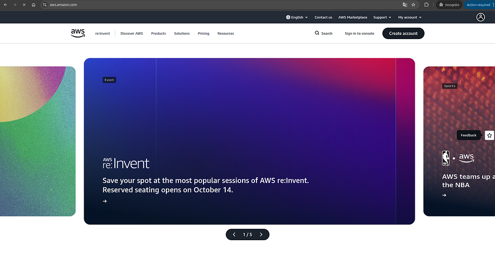
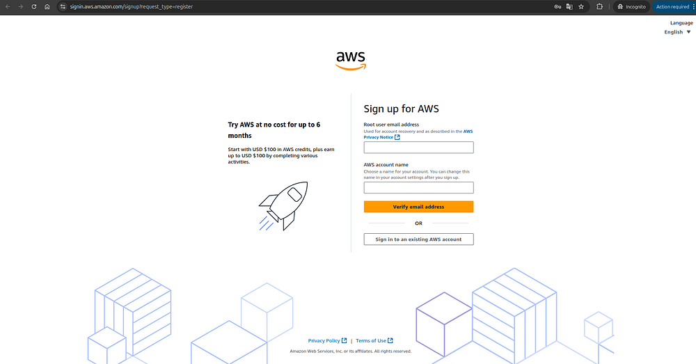
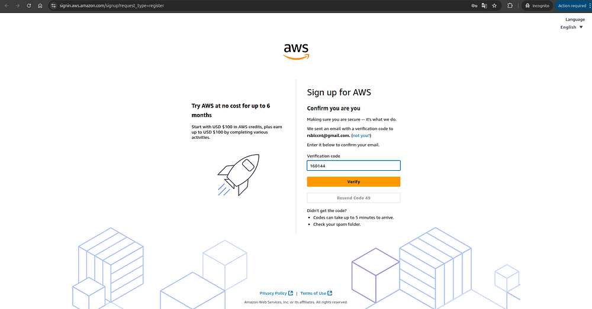
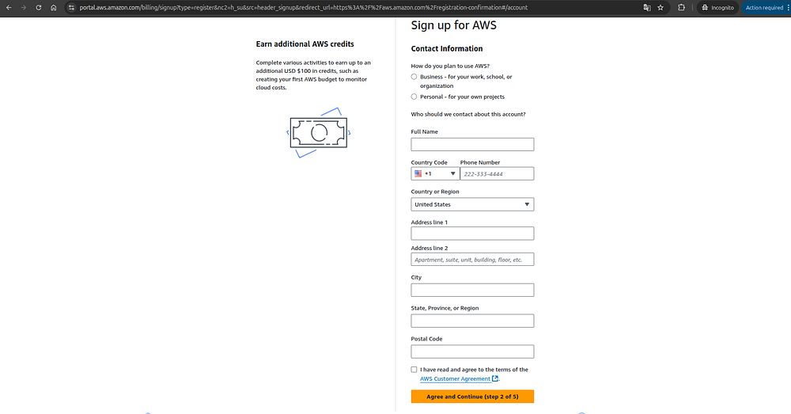
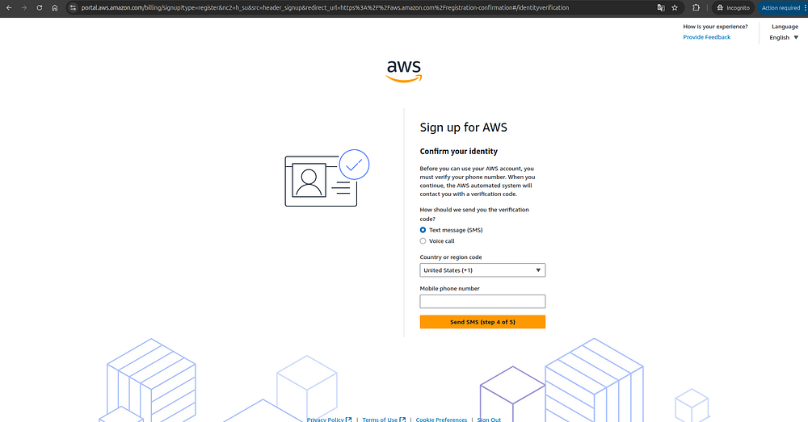
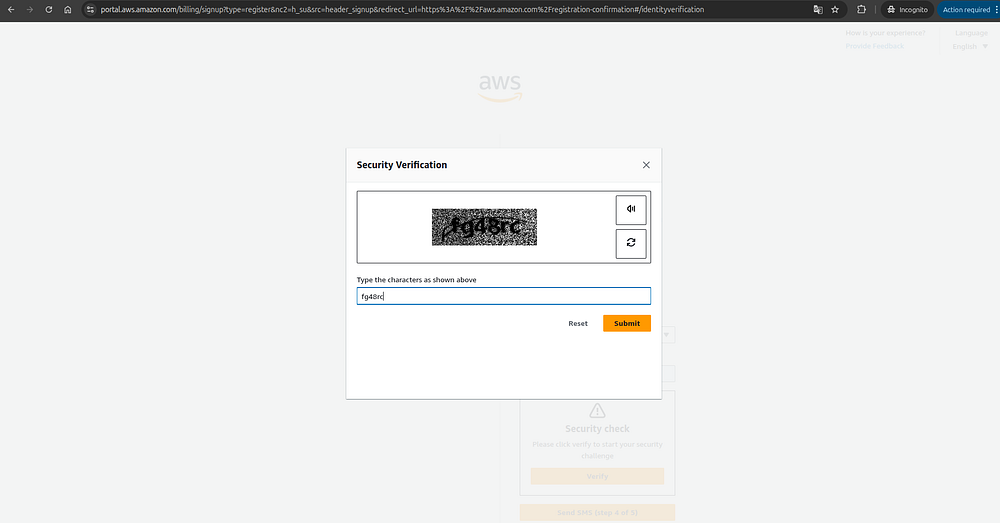
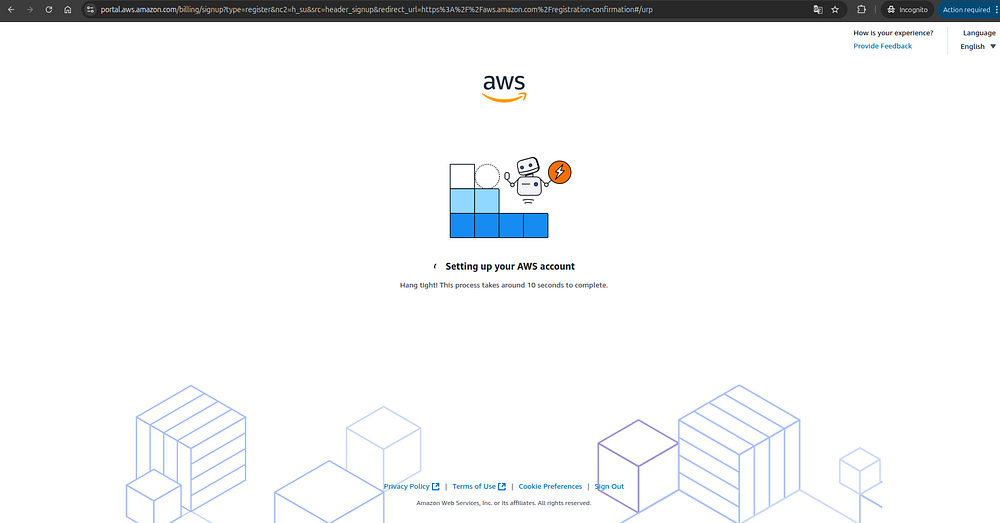
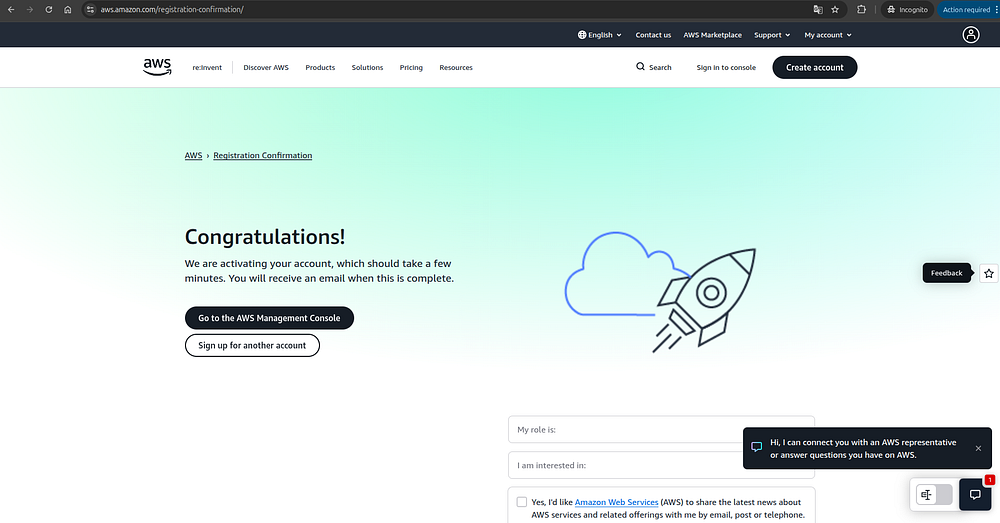
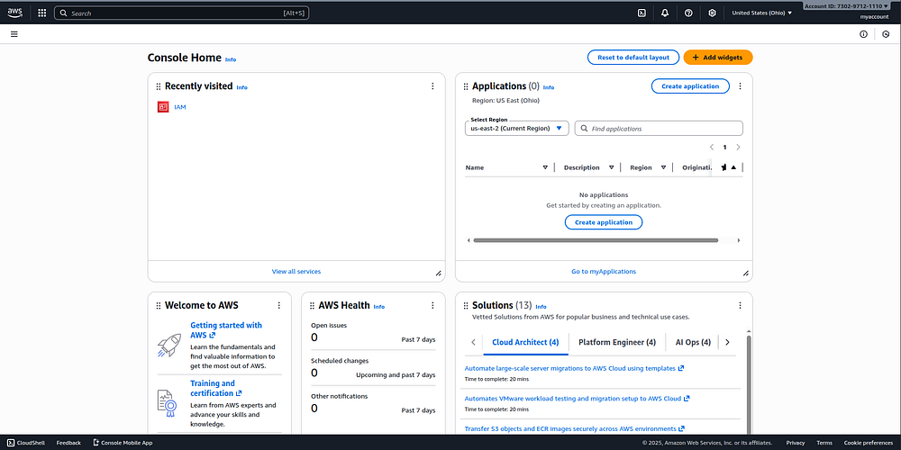

# aws account setup

## Guide to Creating Your AWS Account

#### Requirements

* **An email address** to register and receive a verification code.
* **A credit or debit card** with at least $1–$2 available. AWS will temporarily charge this small amount to verify your card, but it will be refunded after verification. If you don’t want to use your main card, you can use a **virtual or temporary card** — several mobile apps offer this option depending on your country.



### Go to aws.amazon.com and click “Create account”




### Fill in the required fields

Enter your **email address** and choose a **name for your account**, then click **“Verify email address.”**




### Check your email inbox

You’ll receive a message from AWS containing a **verification code** to confirm that the email address belongs to you.\
Enter the code in the **“Verification code”** field and click **“Verify.”**


If you don’t see the email after a few minutes, check your **spam or junk folder**, as it may have been filtered there.





### Set a password for your root user

Make sure to choose a **strong and secure password**, since the root user is the main account owner and has full privileges to perform any action — including creating resources that, if misused, could lead to unexpected charges of thousands of dollars.\
Once you’ve created your password, click **“Continue.”**




### Choose a plan

For this tutorial, select the **Free plan** on the left.\
This plan gives you access to a generous set of **free-tier services**, along with **$100 in AWS credits** that you can use from the moment your account is created and for up to **six months** thereafter.




### Fill out your personal information

Enter your **name**, **phone number**, **country**, **address**, **city**, and **postal code**.\
Then, check the box that says **“I have read and agree to the terms of the AWS Customer Agreement,”** and click **“Agree and Continue.”**




### Enter your credit or debit card information

Accept the terms, and click **“Verify and Continue.”**




### Add your phone number

First, select your **country code**, then enter your **phone number**, and finally click **“Send SMS.”**




### Complete the captcha

You’ll now see a **captcha** — this may vary. In my case, it displayed a hard-to-read text. Enter the text into the field provided and click **“Submit.”**




### Verify the code sent to your phone

Enter the code in the **“Verify code”** field and click **“Continue.”**




### Wait for your account to be created

All the steps are now complete! Just wait a few seconds, and your AWS account will be ready to use.




### Go to the AWS Management Console

When the **congratulations screen** appears, click **“Go to the AWS Management Console.”**




That’s it! 🎉 You now have your **AWS account ready** to start using AWS services.\
You’re currently viewing the **AWS Management Console**, where you can create, manage, and explore your own cloud resources within AWS.

### Congratulations on reaching the end of this guide!

You’ve successfully created your own AWS account — the essential first step to start exploring and using Amazon Web Services.
