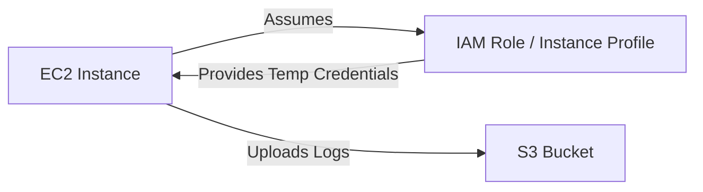

# EC2 to s3 logging guide

This guide provides step-by-step instructions for granting an Amazon EC2 instance permissions to store its logs in an Amazon S3 bucket, followed by practical methods to implement the log transfer.

## Architecture Overview

For security and management best practices, **never use hardcoded AWS Access Keys (`AWS_ACCESS_KEY_ID` and `AWS_SECRET_ACCESS_KEY`) on an EC2 instance.**

Instead, use **IAM Roles for EC2 (Instance Profiles)**. The EC2 instance automatically retrieves temporary security credentials from the AWS Instance Metadata Service (IMDS), allowing it to securely interact with S3.



## Prerequisites

Before starting, ensure you have:

1. An active AWS Account with permissions to create IAM Policies, Roles, and manage EC2/S3.
2. An existing **S3 Bucket** (e.g., `my-ec2-application-logs`).
3. An existing **EC2 Instance** running Linux (Amazon Linux, Ubuntu, RHEL, etc.).

## Phase 1: IAM Permissions & Role Setup



### Create the IAM Policy

We will define a custom IAM policy that enforces the **Principle of Least Privilege**, allowing the EC2 instance _only_ to write logs and not read or delete other data unless absolutely necessary.

1. Open the **IAM Console** (https://console.aws.aws.amazon.com/iam/).
2. In the navigation pane, click **Policies**, then click **Create policy**.
3. Select the **JSON** tab and paste the following policy:

```json
{
    "Version": "2012-10-17",
    "Statement": [
        {
            "Sid": "AllowS3WriteLogs",
            "Effect": "Allow",
            "Action": [
                "s3:PutObject",
                "s3:PutObjectAcl"
            ],
            "Resource": "arn:aws:s3:::YOUR-BUCKET-NAME/*"
        },
        {
            "Sid": "AllowBucketVerification",
            "Effect": "Allow",
            "Action": [
                "s3:GetBucketLocation",
                "s3:ListBucketMultipartUploads"
            ],
            "Resource": "arn:aws:s3:::YOUR-BUCKET-NAME"
        }
    ]
}
```


Replace `YOUR-BUCKET-NAME` with your actual S3 bucket name (e.g., `my-ec2-application-logs`). Note that the first statement specifies `/*` at the end of the bucket ARN (targeting objects), while the second statement targets the bucket itself.


4. Click **Next: Tags** (optional), then click **Next: Review**.
5. Give the policy a descriptive name, e.g., `EC2-S3-LogWriter-Policy`.
6. Click **Create policy**.



### Create the IAM Role for EC2

Next, we create the IAM Role that the EC2 instance will assume.

1. In the IAM Console navigation pane, click **Roles**, then click **Create role**.
2. Under **Select trusted entity**, choose **AWS service**.
3. Under **Service or use case**, select **EC2** from the dropdown, then click **Next**.
4. In the **Permissions policies** search box, search for the policy you created in Step 1 (`EC2-S3-LogWriter-Policy`).
5.  Select the checkbox next to your policy.

    _(Optional)_: If you also plan to use AWS Systems Manager (SSM) to log into the instance without SSH keys, search for and attach the AWS-managed policy `AmazonSSMManagedInstanceCore`.
6. Click **Next**.
7. Name the role, e.g., `EC2-S3-LogWriter-Role`.
8. Provide a description (e.g., _"Allows EC2 instances to write log files directly to S3"_).
9. Click **Create role**.



### Attach the IAM Role to the EC2 Instance

Now, attach this new role to your running or stopped EC2 instance.

1. Open the **Amazon EC2 Console** (https://console.aws.amazon.com/ec2/).
2. In the navigation pane, click **Instances**.
3. Select your EC2 instance.
4. Click **Actions** -> **Security** -> **Modify IAM role**.
5. Under **IAM role**, search for and select your newly created role (`EC2-S3-LogWriter-Role`).
6. Click **Update IAM role** (or **Save**).


The IAM role is attached immediately. You do **not** need to reboot the EC2 instance for this change to take effect.




## Phase 2: Implementation Methods (Sending Logs to S3)

Here are three common methods to configure your EC2 instance to push logs to your S3 bucket.

### Method A: Automated Log Shipping via AWS CLI & Cron Job

This is the simplest method. It uses a cron job that runs a shell script to compress and upload files periodically.



#### Install AWS CLI on the EC2 Instance

Ensure the AWS CLI tool is installed on your instance.

```bash
# On Amazon Linux/CentOS:
sudo yum install aws-cli -y

# On Ubuntu/Debian:
sudo apt-get update && sudo apt-get install awscli -y
```



#### Create the Log Sync Script

Create a script to copy local log files (e.g., Nginx, Apache, or app logs) to S3:

```bash
sudo mkdir -p /opt/scripts
sudo nano /opt/scripts/sync_logs_to_s3.sh
```

Paste the following script content:

```bash
#!/bin/bash

# Configuration
BUCKET_NAME="YOUR-BUCKET-NAME"
INSTANCE_ID=$(curl -s http://169.254.169.254/latest/meta-data/instance-id)
DATE=$(date +%Y-%m-%d)
LOG_DIR="/var/log/nginx" # Target directory to sync

# Sync logs to a structured path in S3: s3://bucket-name/logs/instance-id/YYYY-MM-DD/
aws s3 sync $LOG_DIR s3://$BUCKET_NAME/logs/$INSTANCE_ID/$DATE/ --exclude "*" --include "*.log"
```

Save and exit. Make the script executable:

```bash
sudo chmod +x /opt/scripts/sync_logs_to_s3.sh
```



#### Schedule the Cron Job

Open the root user’s crontab or your custom user's crontab:

```bash
sudo crontab -e
```

Add the following line to run the script hourly (at minute 0):

```
0 * * * * /opt/scripts/sync_logs_to_s3.sh > /dev/null 2>&1
```



### Method B: Unified CloudWatch Agent to S3 (Enterprise Standard)

Instead of shipping files directly from the file system, the standard AWS design pattern is to stream logs to **Amazon CloudWatch Logs** in real-time, and then use a **Subscription Filter** or **CloudWatch Export Task** to batch-store them in S3.

```
EC2 Instance ---> CloudWatch Agent ---> CloudWatch Logs Group ---> S3 Bucket
```

#### Why use this method?

* **Real-time visibility:** View logs immediately in CloudWatch console.
* **Robust buffering:** If S3 is temporarily unreachable, CloudWatch agent buffers logs locally.
* **Standardized formatting:** Structures multi-line logs, adds timestamps, and separates log streams by instance.

#### High-Level Steps

1. Attach the managed IAM policy `CloudWatchAgentServerPolicy` to your EC2 IAM role.
2. Install the Unified CloudWatch Agent on the EC2 instance.
3. Configure the agent configuration file (`amazon-cloudwatch-agent.json`) specifying the log files to monitor.
4. Start the agent.
5. Create a CloudWatch Export Task to export log data to S3 (this can be automated using a Lambda function or an AWS EventBridge scheduler).

### Method C: Custom Logrotate Integration

Logrotate is the standard utility for managing large log files on Linux. You can configure logrotate to automatically compress and upload a log file to S3 right after it is rotated.

1. Edit your logrotate configuration for your application (e.g., `/etc/logrotate.d/nginx`):

```
/var/log/nginx/*.log {
    daily
    missingok
    rotate 14
    compress
    delaycompress
    notifempty
    create 0640 www-data adm
    sharedscripts
    postrotate
        # Upload the rotated file to S3
        INSTANCE_ID=$(curl -s http://169.254.169.254/latest/meta-data/instance-id)
        DATE=$(date +%Y-%m-%d-%H%M)
        aws s3 cp /var/log/nginx/access.log.1.gz s3://YOUR-BUCKET-NAME/rotated-logs/$INSTANCE_ID/nginx-access-$DATE.log.gz
        systemctl reload nginx >/dev/null 2>&1 || true
    endscript
}
```

## Phase 3: Testing & Verification

Log in to your EC2 instance via SSH or SSM Session Manager and perform the following checks:



### Verify IAM Role Credentials

Ensure the EC2 instance can fetch the temporary IAM credentials from the metadata service:

```bash
curl http://169.254.169.254/latest/meta-data/iam/info
```

You should see a JSON response listing the IAM role name `EC2-S3-LogWriter-Role` and its profile details.



### Test S3 Access

Perform a manual test upload to verify that permissions are functioning correctly:

```bash
echo "Test log entry - $(date)" > test_s3_log.txt
aws s3 cp test_s3_log.txt s3://YOUR-BUCKET-NAME/test_s3_log.txt
```

_If successful, it will print an upload confirmation._

Clean up the test file from your bucket:

```bash
aws s3 rm s3://YOUR-BUCKET-NAME/test_s3_log.txt
rm test_s3_log.txt
```



## Troubleshooting Common Errors

<details>

<summary>Error: <code>An error occurred (AccessDenied) when calling the PutObject operation</code></summary>

**Possible Causes:**

1. **Incorrect Bucket Name**: Ensure the bucket name in your policy JSON exactly matches your target bucket.
2. **Path Misalignment**: Make sure you are appending `/*` to the bucket resource in the IAM Policy statement for `PutObject` (e.g., `arn:aws:s3:::my-bucket/*`). If you omit the `/*`, the policy allows writing to a folder/bucket key named exactly after the bucket, which is invalid.
3. **KMS Encrypted Bucket**: If your S3 bucket uses default encryption with an AWS KMS customer managed key (CMK) instead of standard Amazon S3 managed keys (SSE-S3), your IAM role must also have permission to use that KMS key.
   * _Solution_: Add `kms:GenerateDataKey` and `kms:Decrypt` actions to the IAM role policy, referencing the KMS Key ARN as the resource.

</details>

<details>

<summary>Error: <code>curl: (7) Failed to connect to 169.254.169.254 port 80: Connection timed out</code></summary>

**Possible Causes:**

* You are attempting to call the Instance Metadata Service (IMDS) from a container or behind a firewall/proxy that blocks link-local addresses.
* If using IMDSv2 (default on newer AWS AMIs), you must pass a session token:

```bash
TOKEN=$(curl -s -X PUT "http://169.254.169.254/latest/api/token" -H "X-aws-ec2-metadata-token-ttl-seconds: 21600")
INSTANCE_ID=$(curl -s -H "X-aws-ec2-metadata-token: $TOKEN" http://169.254.169.254/latest/meta-data/instance-id)
```

</details>
