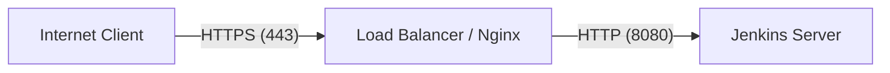

# RBAC

## 1. Jenkins RBAC (Role-Based Access Control)


**RBAC in Jenkins** allows you to give users or groups only the specific permissions they need based on their role, following the principle of least privilege.


### Implementation Steps

The most common way to implement RBAC is using the **Role-based Authorization Strategy** plugin.



### Install Plugin

Go to Manage Jenkins → Plugins and install `Role-based Authorization Strategy`.



### Enable Strategy

Go to Manage Jenkins → Security → Authorization and select **Role-Based Strategy**.



### Create Roles

Go to Manage Jenkins → Manage and Assign Roles → Manage Roles.

* **Global roles:** Jenkins-wide permissions (e.g., `admin`, `developer`).
* **Item roles:** Permissions for specific jobs/folders (e.g., `project-a-developer` with pattern `project-a/.*`).
* **Agent roles:** Permissions for specific build agents.



### Assign Roles

Map users/groups to the created roles in "Assign Roles".



### Real-Time Example

* **DevOps Team:** Full job management.
* **Developers:** Read, Build, and Cancel permissions **only** for their specific project.
* **QA Team:** Read and Build permissions for testing projects only.
* **Jenkins Admin:** Full Jenkins administration.


**Important limitation:** Jenkins' internal user database does NOT natively support creating user groups.

**Best Practice:** Use an external authentication system like **LDAP / Active Directory**. The external system handles the user groups (e.g., `developers`), and Jenkins maps that group to a Jenkins role using the Role-Based Authorization Strategy.


## 2. HTTP vs HTTPS

| Feature             | HTTP                        | HTTPS                              |
| ------------------- | --------------------------- | ---------------------------------- |
| **Full form**       | HyperText Transfer Protocol | HyperText Transfer Protocol Secure |
| **Security**        | ❌ Not encrypted             | ✅ Encrypted                        |
| **Default port**    | 80                          | 443                                |
| **Encryption**      | No                          | Yes, using TLS                     |
| **Data protection** | Vulnerable to sniffing      | Protected from interception        |
| **Certificate**     | Not required                | SSL/TLS certificate required       |

### How HTTPS Works



### Connect to the server

Client connects to server on port `443`.



### Present the certificate

Server presents TLS certificate.



### Validate the certificate

Client validates certificate and a TLS handshake occurs.



### Establish encryption keys

Encryption keys are established.



### Send encrypted HTTP communication

HTTP communication happens _inside_ the encrypted TLS connection.



### DevOps Architecture Example

In production, you generally do not expose Jenkins directly via HTTP on port `8080`. Instead:



The public traffic is encrypted with HTTPS, while the reverse proxy/load balancer forwards internal traffic to Jenkins over HTTP.

## 3. Tomcat Ports


Tomcat's default HTTP application port is **8080**.


### Common Tomcat Ports

| Port     | Purpose                                       |
| -------- | --------------------------------------------- |
| **8080** | HTTP connector — default application traffic  |
| **8443** | HTTPS connector — commonly configured for TLS |
| **8005** | Shutdown port                                 |
| **8009** | AJP connector                                 |

### Configuring the Port

The port configuration is located in `$CATALINA_HOME/conf/server.xml`.

```xml
<Connector port="8080"
           protocol="HTTP/1.1"
           connectionTimeout="20000"
           redirectPort="8443" />
```

To change the port (e.g., to 9090), modify the `port="8080"` attribute to `9090`, then restart Tomcat:

```bash
sudo systemctl restart tomcat
```

Check if it's running on the new port:

```bash
ss -lntp | grep 9090
```
