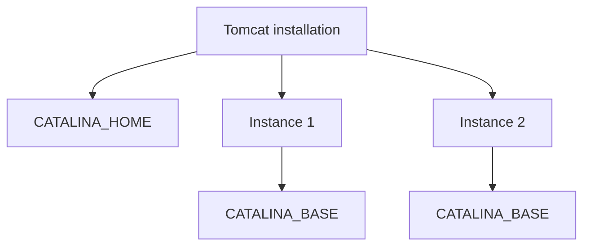
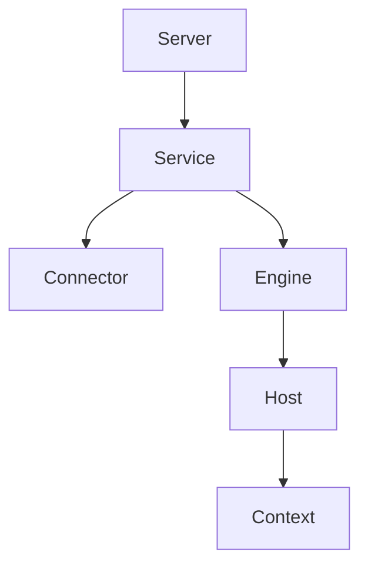
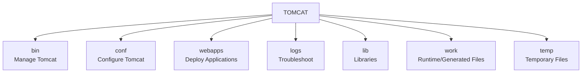

# Tomcat\_Directory\_Structure


For Tomcat training, it's crucial to teach the directory structure from a **DevOps/production troubleshooting perspective**. Students should understand what each directory contains, who uses it, what changes there, and what happens when something goes wrong.


## Overview

A typical Tomcat installation looks like:

```
/apache-tomcat/
│
├── bin/
├── conf/
├── lib/
├── logs/
├── temp/
├── webapps/
├── work/
└── webapps.dist/     (Ubuntu/Debian installations may have this)
```

The most important directories for DevOps engineers are: `bin/`, `conf/`, `webapps/`, `logs/`, `lib/`, `work/`, and `temp/`.

## CATALINA\_HOME vs CATALINA\_BASE

This is one of the most important concepts to teach.

* **`CATALINA_HOME`**: Points to the Tomcat installation directory (e.g., `/opt/tomcat`). It contains Tomcat's binaries and core files.
* **`CATALINA_BASE`**: Represents the runtime/instance directory (e.g., `/opt/tomcat-instance`). It contains `conf/`, `logs/`, `webapps/`, `work/`, and `temp/`.

**Why are both useful?**

Suppose you want to run two Tomcat instances using the same Tomcat installation. This is useful when running multiple applications or environments on the same server.




**For beginners, simply remember:**

* `CATALINA_HOME` = Tomcat software
* `CATALINA_BASE` = Tomcat runtime instance


## `bin/` — Tomcat Executables and Startup Scripts

This is the directory students will frequently use while managing Tomcat manually.

### Important files

* **`startup.sh`**: Starts Tomcat in the background. (e.g., `./startup.sh` or `$CATALINA_HOME/bin/startup.sh`)
* **`shutdown.sh`**: Stops Tomcat.
* **`catalina.sh`**: The most important script. `startup.sh` and `shutdown.sh` internally use this.
  * `./catalina.sh start` -> Starts in background
  * `./catalina.sh run` -> Starts in foreground (excellent for troubleshooting startup errors directly in the terminal)
* **`version.sh`**: Shows Tomcat and Java information.

## `conf/` — Configuration Directory

This is probably the **#1 directory** to focus on during Tomcat training.

### `server.xml` — Critical Configuration

Location: `$CATALINA_HOME/conf/server.xml`

This is Tomcat's primary server configuration file.

**Hierarchy:**



#### Tomcat Port (Connector)

Students frequently need to find the Tomcat port.

```xml
<Connector port="8080"
           protocol="HTTP/1.1"
           connectionTimeout="20000"
           redirectPort="8443" />
```

* `8080` → HTTP
* `8443` → HTTPS redirect/secure connector


If someone asks: _"Tomcat is running, but I cannot access the application."_

Have them check the port:

```bash
grep -n "Connector" conf/server.xml
```

Then check if it's listening:

```bash
ss -lntp | grep 8080
```


#### HTTPS Configuration Example

```xml
<Connector
    port="8443"
    protocol="org.apache.coyote.http11.Http11NioProtocol"
    SSLEnabled="true"
    scheme="https"
    secure="true"
    keystoreFile="/opt/tomcat/conf/keystore.jks"
    keystorePass="changeit" />
```


In production, TLS termination is often done at the load balancer (like Nginx) rather than directly in Tomcat.


### `web.xml`

Location: `conf/web.xml`

Global deployment descriptor. Defines default web application behavior.

* `conf/web.xml` -> Global/default configuration
* `WEB-INF/web.xml` -> Application-specific configuration

### `context.xml`

Location: `conf/context.xml`

Contains default Tomcat Context configuration. A Context represents a deployed web application.

### `tomcat-users.xml`

Location: `conf/tomcat-users.xml`

Defines Tomcat users and roles (e.g., for Tomcat Manager).


**Important security point for students:** Never teach students to use `password="password"` in production, and explain that exposing Tomcat Manager directly to the internet is a severe security risk.


### `catalina.properties` & `logging.properties`

* **`catalina.properties`**: Controls class-loading behavior. Important for `ClassNotFoundException`.
* **`logging.properties`**: Controls Tomcat's Java logging configuration.

## `webapps/` — Application Deployment

The second most important directory where applications are deployed (e.g., `ROOT/`, `manager/`, `myapp/`).

### WAR File Deployment

Copy a `.war` file to `webapps/`:

```bash
cp myapp.war /opt/tomcat/webapps/
```

Tomcat automatically extracts it into a folder (`myapp/`). The application URL normally becomes `http://server-ip:8080/myapp`.

### The `ROOT/` Application

`http://server-ip:8080/` points to the `ROOT` application, whereas `http://server-ip:8080/myapp` points to `myapp/`.

### `WEB-INF` Directory

Inside an application (e.g., `myapp/WEB-INF/`), this folder is special. A client cannot directly access resources under it over HTTP.

* **`WEB-INF/classes/`**: Compiled Java classes (`.class`). Important for troubleshooting `ClassNotFoundException`.
* **`WEB-INF/lib/`**: Application-specific JAR files. Important for dependency conflicts.

## `logs/` — Production Troubleshooting

The most important directory for DevOps during production issues.

* **`catalina.out`**: First place to check for errors (e.g., `OutOfMemoryError`, `Address already in use`). Use `tail -f logs/catalina.out`.
* **Access Logs** (e.g., `localhost_access_log.txt`): Records HTTP requests (e.g., `GET /myapp HTTP/1.1 200`).

## `temp/`, `work/`, and `lib/`

* **`temp/`**: Temporary processing files.
* **`work/`**: Generated runtime working files (e.g., compiled JSPs). If a JSP behaves strangely, this folder is relevant.
* **`lib/`**: Shared Tomcat libraries.
  * `$CATALINA_HOME/lib` -> Tomcat-wide libraries
  * `webapps/myapp/WEB-INF/lib` -> Application-specific libraries

## The 5 Paths Students Must Remember

1. **`bin/`**: _How do I start/stop Tomcat?_ (`./startup.sh`)
2. **`conf/server.xml`**: _Where is the port configured?_ (`grep -n "Connector" conf/server.xml`)
3. **`webapps/`**: _Where is my app deployed?_ (`ls -lh webapps/`)
4. **`logs/`**: _Why is my app failing?_ (`tail -f logs/catalina.out`)
5. **`work/`**: _Where are compiled JSPs?_ (`ls -R work/`)

## Production Troubleshooting Flow (Classroom Exercise)

Scenario: _"My application is deployed, but I cannot access it."_ (Don't immediately restart Tomcat!)



### Check process

```bash
ps -ef | grep tomcat
```



### Check port

```bash
ss -lntp | grep 8080
```



### Check server.xml

```bash
grep -n "Connector" conf/server.xml
```



### Check deployment

```bash
ls -lh webapps/
```



### Check logs

```bash
tail -100 logs/catalina.out
```



### Test locally

```bash
curl http://localhost:8080/myapp
```

Helps separate a Tomcat problem from a Network/LB problem.



## Simple Mental Model




For a DevOps training session, spend the most time on `bin/`, `conf/server.xml`, `webapps/`, `WEB-INF/`, and `logs/`—these are the paths students will repeatedly use in deployment, troubleshooting, and production support.

