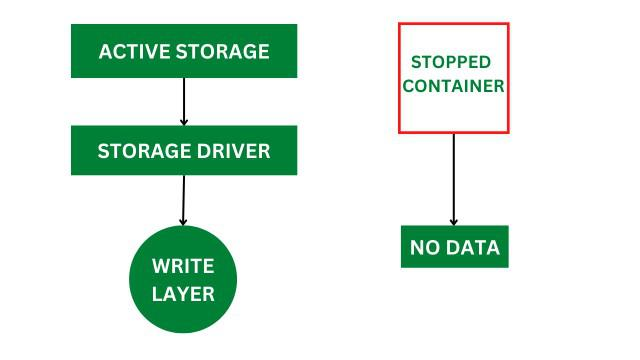

# architecture of docker

Docker makes use of a client-server architecture. The Docker client talks with the Docker daemon, which helps in building, running, and distributing Docker containers. The Docker client runs with the daemon on the same system, or we can connect the Docker client with the Docker daemon remotely. With the help of REST API over a UNIX socket or a network, the Docker client and daemon interact with each other.

<figure><figcaption></figcaption></figure>

### What is Docker Daemon?

Docker daemon manages all the services by communicating with other daemons. It manages Docker objects such as images, containers, networks, and volumes with the help of the API requests of Docker.

### Docker Client

With the help of the Docker client, Docker users can interact with Docker. The Docker command uses the Docker API. The Docker client can communicate with multiple daemons. When a Docker client runs any Docker command on the Docker terminal, the terminal sends instructions to the daemon. The Docker daemon gets those instructions from the Docker client in the form of the command and REST API requests.

The main objective of the Docker client is to provide a way to direct the pull of images from the Docker registry and run them on the Docker host. The common commands used by clients are **docker build**, **docker pull**, and **docker run**.

### Docker Host

A Docker host is a type of machine that is responsible for running more than one container. It comprises the Docker daemon, images, containers, networks, and storage.

### Docker Registry

All the Docker images are stored in the Docker registry. There is a public registry known as a [**docker hub**](https://www.geeksforgeeks.org/devops/what-is-docker-hub/) that can be used by anyone. We can run our private registry also. With the help of **docker run** or **docker pull** commands, we can pull the required images from our configured registry. Images are pushed into configured registry with the help of the **docker push** command.

### Docker Objects

Whenever we are using Docker, we are creating and using images, containers, volumes, networks, and other objects. Now, we are going to discuss Docker objects:

<figure><figcaption></figcaption></figure>

### Docker Images

An image contains instructions for creating a Docker container. It is just a **read-only template**. It is used to store and ship applications. Images are an important part of the Docker experience as they enable collaboration between developers in any way which was not possible earlier.

### Docker Containers

Containers are created from Docker images as they are ready applications. With the help of Docker API or CLI, we can start, stop, delete, or move a container. A container can access only those resources which are defined in the image unless additional access is defined during the building of an image in the container.

### Docker Storage

We can store data within the writable layer of the container, but it requires a storage driver. [Storage driver](https://www.geeksforgeeks.org/cloud-computing/data-storage-in-docker/) controls and manages the images and containers on our Docker host.

<figure><figcaption></figcaption></figure>

### Types of Docker Storage

1. **Data Volumes:** Data Volumes can be mounted directly into the filesystem of the container and are essentially directories or files on the Docker Host filesystem.
2. **Volume Container:** In order to maintain the state of the containers (data) produced by the running container, Docker volumes file systems are mounted on Docker containers. Independent of the container life cycle, the volumes are stored on the host. This makes it simple for users to exchange file systems among containers and backup data.
3. **Directory Mounts:** A host directory that is mounted as a volume in your container might be specified.
4. **Storage Plugins:** Docker volume plugins enable us to integrate the Docker containers with external volumes like Amazon EBS. By this, we can maintain the state of the container.

### Docker Networking

[Docker networking](https://www.geeksforgeeks.org/devops/basics-of-docker-networking/) provides complete isolation for Docker containers. It means a user can link a Docker container to many networks. It requires very less OS instances to run the workload.

#### Types of Docker Network

1. **Bridge:** It is the default network driver. We can use this when different containers communicate with the same Docker host.
2. **Host:** When you don't need any isolation between the container and host, it is used.
3. **Overlay:** For communication with each other, it will enable the swarm services.
4. **None:** It disables all networking.
5. **macvlan:** This network assigns MAC (Media Access Control) address to the containers which look like a physical address.
