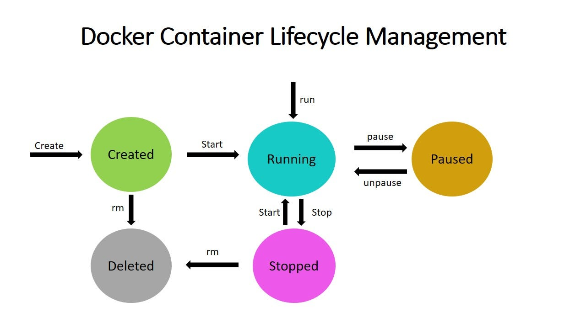

# container lifecycle

_**Docker Container Lifecycle Management**_

Docker is a containerization platform that allows you to develop, ship, and run applications inside containers. We can run multiple containers on a single host at the same time. Containers are very fast and boot up quickly because, unlike virtual machines, they do not require the extra load of a hypervisor because they run directly within the host machine’s kernel. This blog will discuss _**Docker Container Lifecycle Management**_.

## Docker Container Lifecycle Management

The Docker Container Lifecycle describes the various stages that occur when we create a Docker container. Among the states are:

* **Created**: A container that has been created but not started
* **Running**: A container running with all its processes
* **Paused**: A container whose processes have been paused
* **Stopped**: A container whose processes have been stopped
* **Deleted**: A container in a dead state

<figure><figcaption></figcaption></figure>

Docker Container Lifecycle Management is the process of managing the states of Docker containers. We must ensure that the containers are operational or that they are destroyed if they are no longer useful. We have some common commands for managing the Docker Lifecycle, which are explained below.

The lifecycle of a docker container consists of five states:



## Created state

In the created state, a docker container is created from a docker image.

```bash
docker create --name <name-of-container> <docker-image-name>
```



## Running state

When the docker container is running, it begins executing the commands shown in the image. The docker run command is used to start a docker container.

```bash
docker run <container-id>
or
docker run <container-name>
```

If no container is present, the docker run command creates one. In this case, the container creation can be skipped.



## Paused state

The current command in the docker container is paused when it is in the paused state. To pause a running container, use the docker pause command.

```bash
docker pause container <container-id or container-name>
```


_Note: docker pause pauses all the processes in the container. It sends the SIGSTOP signal to pause the processes in the container._




## Unpaused state

When the container is unpaused, it resumes executing the commands that were paused. Then, Docker sends the SIGCONT signal to resume the process.

```bash
docker unpause <container-id or container-name>
```



## Stopped state

The container’s main process is gracefully shutdown in the stopped state. Docker sends SIGTERM for graceful shutdown and SIGKILL to kill the container’s main process if necessary. To stop a container, use the docker stop command.

```bash
docker stop <container-id or container-name>
```

Restarting a docker container would result in a docker stop followed by a docker run, i.e., stop and run phases.



## Killed/Deleted state

The container’s main processes are terminated abruptly in the killed state. Docker sends a SIGKILL signal to the container’s main process to terminate it.

```bash
docker kill <container-id or container-name>
```



## Difference between Docker Create, Docker Start And Docker Run

The **Docker create command** creates a new container based on the image specified. However, the container will not be started immediately.

The **Docker start command** is used to restart any previously stopped container. If we used docker to create a container command, then we can start it with this command.

**Docker run** is a combination of create and start because it creates a new container and immediately starts it. In fact, if the mentioned image is not found on your system, the docker run command can even pull an image from Docker Hub.

## Difference Between Docker Pause And Docker Stop container

The **docker pause command** suspends all processes in the containers specified. When suspending a process, the SIGSTOP signal is traditionally used, which is visible to the process being suspended. Furthermore, the memory portion would be present while the container is paused and used again when the container is resumed.

When we use the **docker stop command**, the main process inside the container receives SIGTERM, followed by SIGKILL after some time. It will also release the memory used after the container has been stopped.

SIGTERM is the termination signal. The intention is to end the process gracefully or not, but to give it a chance to clean up first.\
The kill signal is SIGKILL. The only appropriate behaviour is to terminate the process immediately.

The pause signal is SIGSTOP. The only action is to halt the process. To implement job control, the shell employs pausing (and its counterpart, resuming via SIGCONT).

## Conclusion

**Docker** is an open platform for developing, shipping, and running applications. Docker enables you to separate your applications from your infrastructure so you can deliver software quickly. With Docker, you can manage your infrastructure in the same ways you manage your applications.
