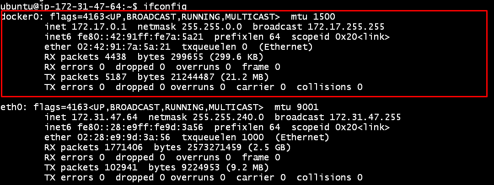
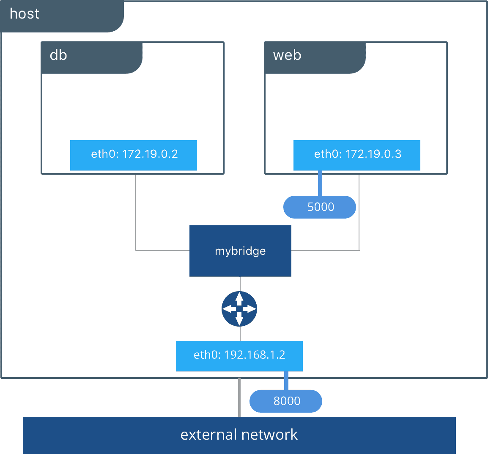
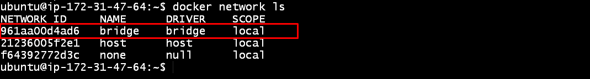
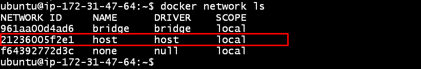
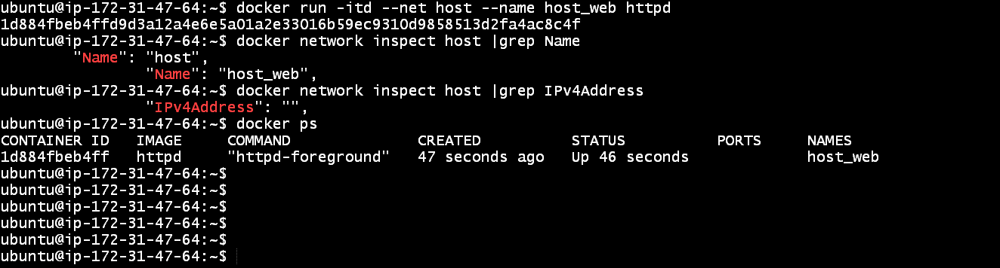
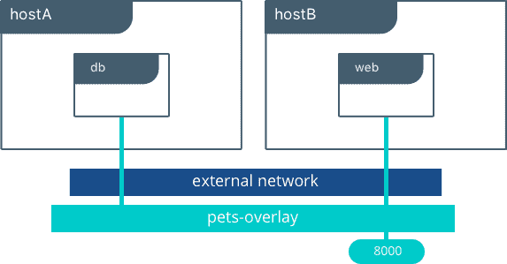
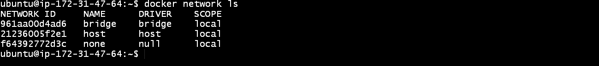
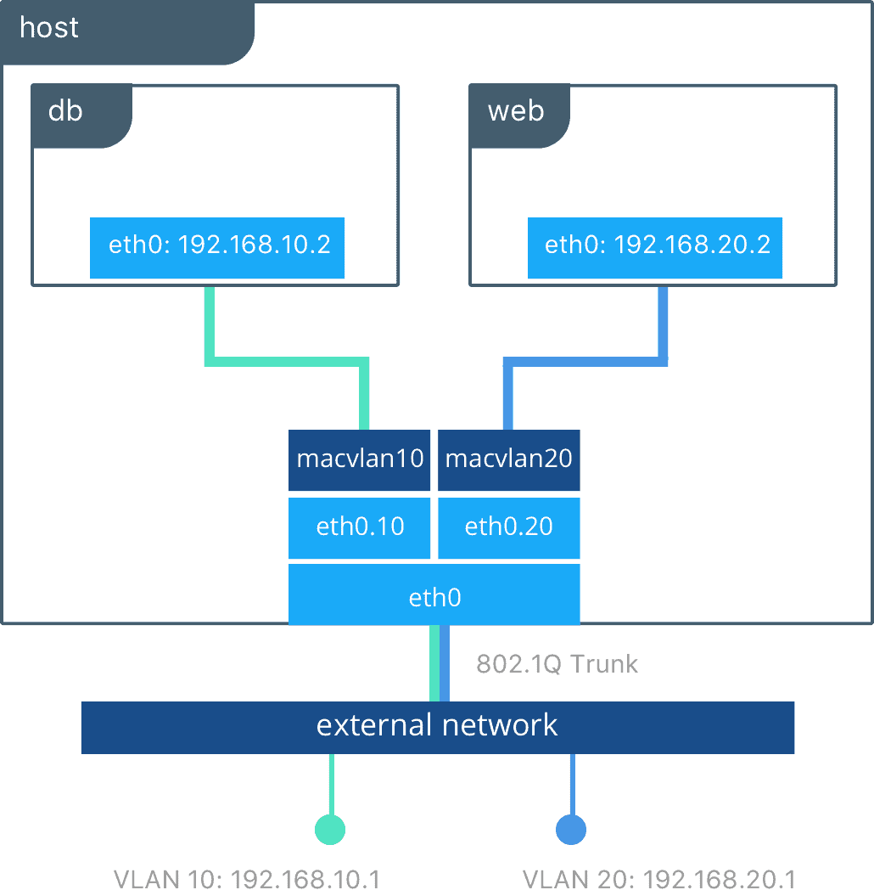
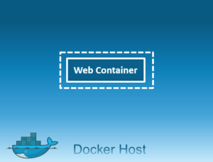

# docker networking

<figure><figcaption></figcaption></figure>

### Docker Network

* Docker networking is primarily used to establish communication between Docker containers and the outside world via the host machine.
* Docker Networks are used to provide complete isolation for Docker containers.
* Docker uses Linux’s [Namespace](https://medium.com/@BeNitinAgarwal/understanding-the-docker-internals-7ccb052ce) for resource isolation, which includes network resources.
* Docker isolates the network through Network Namespace and provides an independent network environment, including network cards, routing, Iptable rules, and so on.
* When Docker is installed, a default bridge network named `docker0` is created. Each new Docker container is automatically attached to this network unless a custom network is specified.
* If you do an ifconfig on the Docker Host, you will see the Docker Ethernet adapter.

<figure><figcaption></figcaption></figure>

Also, check if you need to know about [docker0 and etho](https://stackoverflow.com/questions/37536687/what-is-the-relation-between-docker0-and-eth0).

Docker supports networking for its containers via network drivers. These drivers have several network drivers.

* Bridge
* Host
* Overlay
* Macvlan
* None

### The Bridge Driver

<figure><figcaption></figcaption></figure>

* It is a private default network created on the host.
* Containers linked to this network have an internal IP address through which they communicate with each other easily.
* The Docker server (daemon) creates a virtual ethernet bridge docker0 that operates automatically, by delivering packets among various network interfaces.

**Let’s see in action**

```shell
$ docker network ls
```

<figure><figcaption></figcaption></figure>

We will create two nginx containers and see which network it attaching to.

```shell
$ docker run -itd --name nginx1 nginx$ docker run -itd --name nginx2 nginx$ docker ps $ docker network inspect bridge |grep Name
```

<figure><figcaption></figcaption></figure>

Here, both Nginx containers are attached to the bridge network.

### The Host Driver

<figure><figcaption></figcaption></figure>

* It is a public network.
* The container will use the host’s IP and port to run services inside the container.
* It removes network isolation between the container and the host machine where Docker is running
* For example, If you run a container that binds to port 80 and uses host networking, the container’s application is available on port 80 on the host’s IP address.
* One limitation with the host driver is that it does work on Linux hosts but not on Windows and Mac.
* It does not require network address translation (NAT).

```shell
$ docker network ls
```

<figure><figcaption></figcaption></figure>

Create an httpd container in host networking.

```shell
$ docker run -itd --net host --name host_web httpd
```

To check the container created within-host network:

```shell
$ docker network inspect host |grep Name
```

The IP address of the container within-host network is null.

```shell
$ docker network inspect host |grep IPv4Address
```

<figure><figcaption></figcaption></figure>

Access the web container with Public IP.

<figure><figcaption></figcaption></figure>

## Overlay Driver

<figure><figcaption></figcaption></figure>

* Overlay allows containers across the host to communicate with each other without worrying about the setup.
* It is for multi-host network communication, as with Docker Swarm or Kubernetes.
* It creates an internal private network that spans across all the nodes participating in the swarm cluster
* Think of an overlay network as a distributed virtualized network that’s built on top of an existing computer network.

```shell
$ docker network ls
```

<figure><figcaption></figcaption></figure>

You don’t see any overlay network driver created by docker and can’t create it for the common use of docker container.

Let try to create it.

```shell
$ docker network create -d overlay myStack1
```

<figure><figcaption></figcaption></figure>

In order to use the Overlay network, we have to use the Swarm service. we will see the Docker Swarm section.

## Macvlan Driver

<figure><figcaption></figcaption></figure>

* Macvlan networks allow you to assign a MAC address to a container, making it appear as a physical device on your network.
* The Docker daemon routes traffic to containers by their MAC addresses.
* Using the `macvlan` driver is sometimes the best choice when dealing with legacy applications that expect to be directly connected to the physical network.
* It is suitable when a user wants to directly connect the container to the physical network rather than the Docker host.

```shell
docker network ls
```

<figure><figcaption></figcaption></figure>

You don’t see any macvlan network driver created by docker.

Create MACVLAN network “mvnet” bound to eth0 on the host.

```shell
$ docker network create -d macvlan --subnet 192.168.0.0/24 --gateway 192.168.0.1 -o parent=eth0 mvnet
```

Create two containers C1 and C2 on the “mvnet” network and ping the C1 from C2 with the container’s C1 IP address.

```shell
$ docker run -itd --name C1 --net mvnet --ip 192.168.0.3 busybox sh
$ docker run -it --name C2 --net mvnet --ip 192.168.0.4 busybox sh
$ ping 192.168.0.3
```

In the above example, we have created a macvlan network `eth0` on the host and also attach two containers to the macvlan network and show that they can ping between themselves with the container’s IP.

<figure><figcaption></figcaption></figure>

## None Driver

<figure><figcaption></figcaption></figure>

* In this kind of network, containers are not attached to any network.
* It does not have any access to the external network or other containers.
* This network is used when you want to completely disable the networking stack on a container and, only create a loopback device.

```shell
$ docker network ls
```

<figure><figcaption></figcaption></figure>

## Basic Docker Networking Commands

**List down the Networks associated with Docker**

```shell
$ docker network ls
```

**Creating a Network**

```shell
$ docker network create mynetwork
```

**Disconnecting a Container from the Network**

```shell
$ docker network disconnect mynetwork 0f8d7a833f42
```

**Displays detailed information on one or more networks.**

```shell
$ docker network inspect mynetwork 
```

**Remove all Unused Networks**

```shell
$ docker network prune
```
