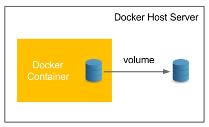
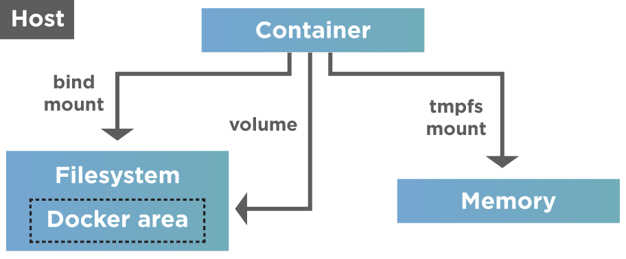

# volumes

<figure><figcaption></figcaption></figure>

Docker volumes are file systems mounted on Docker containers to preserve data generated by the running container.

* The data doesn’t persist when that container no longer exists, and it can be difficult to get the data out of the container.
* Volumes are easier to back up or migrate than bind mounts.
* You can manage volumes using Docker CLI commands or the Docker API.
* Volumes work on both Linux and Windows containers.
* Volumes can be more safely shared among multiple containers.
* So, to keep the Data persist in the docker container, we need a concept called Docker Volume or Bind Mounts.

## Data Management in Docker

* For example, If you are working on the Jenkins instance that is running in the Docker Container, you will lose the Jobs created, users, configurations changes, and everything once you restart the container.
* We can implement multiple strategies to persist data or add persistence to containers.
* These strategies are shown in the diagram below.

<figure><figcaption></figcaption></figure>

## Docker Volume

<figure><figcaption></figcaption></figure>

* Volumes are stored in a part of the host filesystem, _managed by Docker_ (`/var/lib/docker/volumes/` on Linux).
* When we create a volume, it is stored within a directory on the Docker host. Volumes are managed by Docker.
* Volumes are the best way to persist data in Docker and are isolated from the core functionality of the host machine.
* Volumes also support _volume drivers_, allowing storing the data on remote hosts or cloud providers, among other possibilities.

## Bind Mounts

<figure><figcaption></figcaption></figure>

* Bind mounts may be stored _anywhere_ on the host system.
* When we use a bind mount, a file or directory on the _host machine_ is mounted into a container. The file or directory is referenced by its full path on the host machine.
* The file or directory does not need to exist on the Docker host already. It is created on-demand if it does not yet exist.
* The limitation with the Bind Mounts is you cannot use the Docker CLI to manage Bind Mounts.
* You can use `--mount type=bind,source=/host/path/,target=/container/path` to configure the Bind Mounts.

## Tmpfs Mounts

<figure><figcaption></figcaption></figure>

* tmpfs mounts are not the persistent data on the disk.
* It will be available persistent on Neither the Host nor Container filesystem.
* You can create the mount by using `--mount type=tmpfs,destination=/app.`
* To create tmpfs mounts, you don’t have to create a file structure in your host file system.
* You can mention only the destination file path and it will create the directory structure on its own.

## Named Pipes

* A named pipe mount can be used for communication between the Docker host and a container.
* The common use case is to run a third-party tool inside a container and connect to the Docker Engine API using a named pipe.
