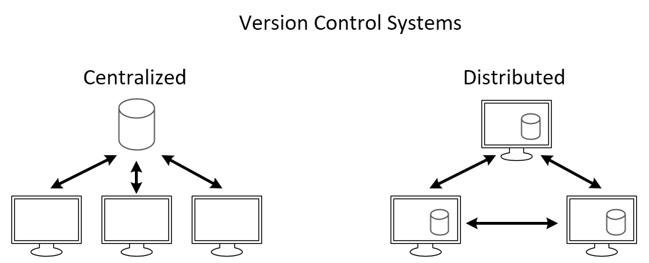
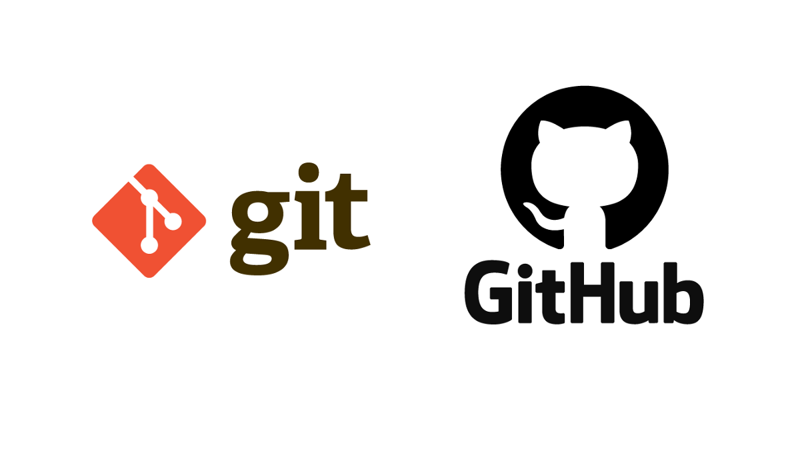
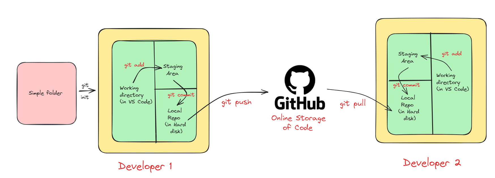
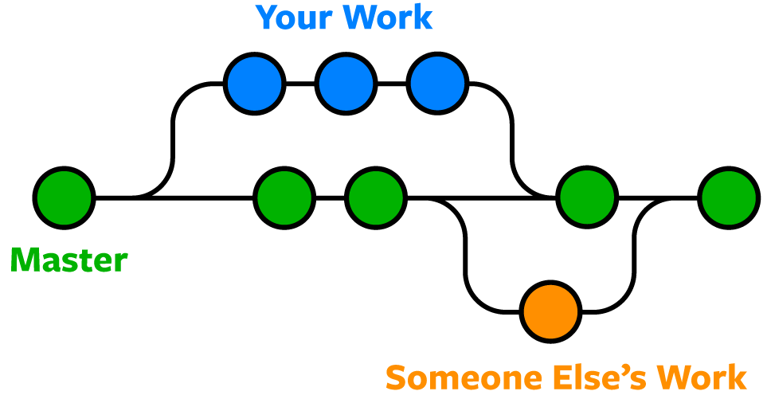

# git and github

### What is Source Code Management?

Source code management is like a digital filing system for computer code. It helps developers work together on projects by keeping track of changes they make to the code. It saves different versions, lets people work on separate parts at the same time, and shows who did what and when. Popular tools include Git, which makes it easy to manage code changes and collaborate with others.



### Types of Source Code Management

There are mainly two types of source code management: centralized and distributed.

1. **Centralized Source Code Management:** In this type, there is a central server that stores the code repository, and developers check out code from this central location to work on it.


### Benefits of Centralized Source Code Management

Centralized source code management systems make teamwork easier by keeping all the project’s code in one place. They help control who can make changes, track those changes over time, and provide a clear history of what happened.

### Drawbacks of Centralized Source Code Management

**a. Single Point of Failure:** The central server is a single point of failure. If it goes down, developers may lose access to the code repository, halting work until it’s restored.

**b. Limited Offline Capabilities:** Centralized systems often require a stable internet connection for developers to access the central server, making collaboration difficult in environments with unreliable or limited internet access.

**c. Difficulty with Branching and Merging:** Branching and merging in centralized systems can be complex and prone to conflicts, especially when multiple developers are working on different features simultaneously.

**2. Distributed Source Code Management:** Here, every developer has a local copy of the entire repository, including its history. Developers can work independently on their local copies and then share their changes with others by pushing them to a central server or directly to other developers. **Git and Mercurial** are popular distributed SCM tools.


### Benefits of Distributed Source Code Management

Distributed source code management (DSCM) offers several advantages over centralized systems:

1. **Flexibility:** DSCM allows developers to work offline and independently on their local copies of the repository, giving them the freedom to experiment and make changes without affecting the central codebase.
2. **Improved Collaboration:** With DSCM, developers can share changes directly with each other without relying on a central server, enabling more efficient collaboration, especially in distributed or remote teams.
3. **Reduced Dependency on Internet:** Since developers have a complete copy of the repository locally, they can work offline and sync their changes later, reducing the dependency on a stable internet connection.

In this blog, we'll explore Git, the famous distributed version control system, and its companion platform GitHub, which offers online storage and collaborative features for managing code projects.

### What is Git?



Git is a tool that helps developers keep track of changes they make to their code. It’s like a time machine for your projects, letting you see what you’ve done and work with others easily.

_To install Git,_ [_**click here**_](https://git-scm.com/book/en/v2/Getting-Started-Installing-Git) _to go official Git installation page._

### Git Workflows

The image I shared illustrates the workflow used with Git and GitHub, a popular tool for managing software development projects. Let’s break it down:

* **Local repository:** Your project’s files are stored in a folder on your computer.
* **Working directory:** This is where you actively make changes to your project’s files, inside your local repository.
* **Staging area:** Here, you temporarily store changes you’ve made before saving them.
* **Commit:** Saving a snapshot of your changes, along with a message describing what you did. (git uses SHA 1 checksum concept for tracking changes.)
* **Local repository (on hard disk):** All your commits are permanently stored on your computer.
* **GitHub repository (online storage of code):** A copy of your local repository stored on GitHub’s servers.
* **Push:** Sending your local commits to your GitHub repository.
* **Pull:** Getting the latest changes from GitHub to your local repository, useful for collaboration.



### Live Demo of Git



#### Create a folder

Create a folder at your desired location (in my case I made demo folder).



#### Initialize Git

Open this terminal inside VS code and in VS code terminal type **git init**.



#### Create a file

Now create a file (in my case I create demo.txt) and add in file something.



#### Add the file to the staging area

In terminal type **git add .** and check status by **git status.** Congratulations, you add your file in staging area.



#### Commit the file

Now Commit this file by using:

```bash
git commit -m "First commit"
```

When you type this command and press enter, you will see the following screen:

This tell you please configure your name and email before committing.

Congratulations, you commit your first file, i.e. it save in you local repo.



#### Upload to GitHub

Now if you want to upload on GitHub (Before this please create your account on GitHub and create there a new repository), and in terminal type below code:

```bash
git remote add origin https://github.com/sachin0612/demo.git
git branch -M main
git push -u origin main
```

Congratulations, your files are reaching at GitHub.



### Some Important Terminology

**git log:** This command shows a history of commits in a repository, displaying information like commit messages, authorship, and timestamps, helping developers understand the project’s evolution.

**git show:** With this command, developers can view detailed information about a specific commit, including changes made to files, providing insights into what was modified and why.

**.gitignore file:** This file specifies intentionally untracked files that Git should ignore, such as temporary files or build artifacts, preventing them from being included in commits and cluttering the repository. It helps keep the repository clean and focused on important files.

### git branch

A Git branch is a separate line of development within a Git repository. It allows developers to work on new features, fixes, or experiments without affecting the main codebase. Each branch represents a distinct set of changes, and developers can create, switch between, merge, and delete branches as needed. Branches are important because they enable parallel development, collaboration among team members, experimentation with new ideas, and the isolation of changes for testing and review, all while keeping the main codebase stable and unaffected.

Here’s a breakdown of the workflow depicted in the image:



#### Create a Branch

You typically start by creating a new branch from the master branch. This creates a copy of the master branch where you can work on your changes without affecting the main codebase.



#### Make Changes

In your local branch (Your Work), you make changes to the code.



#### Commit

When you’re happy with your changes, you commit them to your local branch. This creates a snapshot of your changes at that point in time.



#### Push

Once you’ve committed your changes, you can push them to a remote repository like GitHub. This creates a remote copy of your local branch.



#### Pull Request

When you’re ready to share your changes and have them merged into the master branch, you create a pull request on GitHub. This notifies other developers of your changes and allows them to review your work before merging.



#### Merge

If your changes are approved, they can be merged into the master branch. This integrates your work into the main codebase.





**Some important Commands:**

```bash
# To see list of available branches
git branch

# To Create new branch
git branch <branch name>

# To switch branch
git checkout <branch name>

# Files created in workspace will be visible in any of the branch workspace
# untill you commit. Once you commit, then that files belongs to that particular
# branch.
```

### git merge

Git merge is a command used to integrate changes from one branch into another branch. It combines the changes made in a source branch with the target branch, resulting in a new commit that incorporates the changes from both branches.

Suppose, you have two branches named **main** and **features.** You want to merge features branch to main branch then you first go inside the main branch by:

```bash
git checkout main
```

and from here use following command:

```bash
git merge features
```

In this way, you can merge one branch to other and after that you can push these changes to GitHub.

### Conflicts in git merge

Conflicts in Git merge occur when Git encounters changes in the files that conflict with each other during the merging process. These conflicts arise when: Both branches modify the same lines of code differently, and Git cannot automatically determine which changes to keep.

When conflicts occur, Git marks the conflicted areas in the affected files, indicating where the conflicting changes exist. It’s then up to the developer to resolve these conflicts manually by editing the files to incorporate the desired changes and remove any conflicting content.

To resolve conflicts, developers typically:



#### Open the conflicted files

Open the conflicted files in a text editor.



#### Locate conflict markers

Locate the conflict markers added by Git, indicating the conflicting sections.



#### Resolve the conflicts

Edit the files to resolve the conflicts, choosing which changes to keep or combining them appropriately.



#### Save and stage the resolved files

Save the changes and stage the resolved files using “git add”.



#### Complete the merge

Complete the merge by creating a new merge commit using “git commit”.



### git stash

Git stash is a command used to temporarily store changes that are not ready to be committed to the repository. It’s helpful when you want to switch branches, but you don’t want to commit your changes or lose them. Stashing allows you to save your work in progress and come back to it later.

When you run “git stash”, Git will:



#### Save changes as a stash

Take all the changes in your working directory and index (staging area) and save them as a “stash”.



#### Reset the working directory and index

Reset your working directory and index to the last commit, effectively removing the changes from view.



#### Apply the stashed changes later

You can later apply the stashed changes back to your working directory using “git stash apply” or “git stash pop” commands.



It’s a convenient way to manage your work-in-progress changes without cluttering your commit history or losing any work.

### Important Command for git stash

```bash
# To stash an item
git stash

# To see the stashed items list
git stash list

# To apply stashed items
git stash apply stash@{number}

# To clear the stash item
git stash clear
```

### git reset

Git reset is a command used to undo changes in your working directory to staging area.

```bash
git reset <file name>
        or
git reset .
```

See the workflow of git reset:

### git revert

The revert command helps you undo an existing commit. It does not delete any data in this process instead rather git creates a new commit with the included files reverted to their previous state. So your version control history moves forward while the state of your file moves backward.

```bash
git revert <commit id>
```

**See the workflow:**

So, in this way you can use revert command in Git.

### Removing Untracked File

```bash
git clean -n   #(ask for delete yes or no)
git clean -f   #(forcefully)
```

### Tags

It is used to gives meaningful names to a specific version in the repository.

```bash
git tag -a <tag name> -m <message> <commit-id>

# To see the list of tags
git tag

# To see particular commit content by using tag
git show <tag name>

# To delete a tag
git tag -d <tag name>
```

I hope this blog has enhanced your comprehension of the git and github concept. If you’ve gained value from this content, consider following me for more insightful posts. Appreciate your time in reading this article. Thank you!
