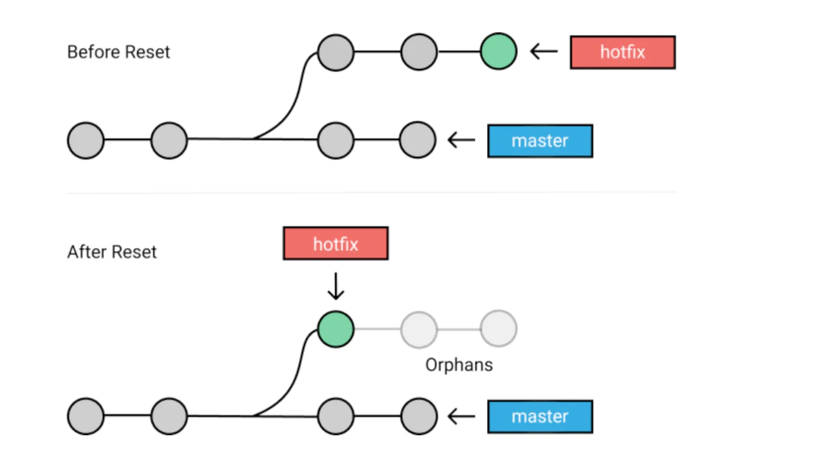
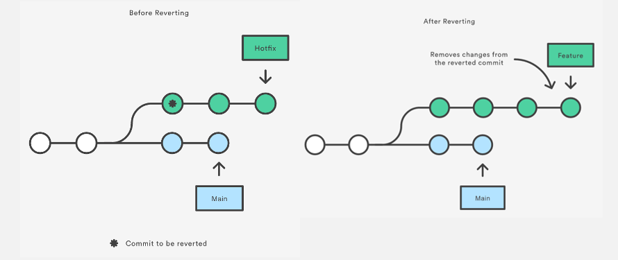

# git reset and revert

## Overview of Git Revert and Reset

Git revert and Git reset are two commands used in Git to undo changes to a project code and history, but in different ways. In this section, we will provide an overview of how to use both revert and reset. Before diving into the process, let’s create a Git project.

**Create a Git project**

Below are the instructions to create a git project and initialize it with some files:

```bash
mkdir git_revert_reset
cd git_revert_reset
git init .
```

* `mkdir git_revert_reset` creates a folder called `git_revert_reset`.
* `cd git_revert_reset` moves to the folder.
* `git init .` initializes the folder as a git repository.

Considering this as a data science project, we can create the following files for data acquisition, data preprocessing, and model training using this `touch` command:

```bash
touch data_acquisition.py data_preprocessing.py model_training.py
```

This is the final content of the project folder.

```
git_revert_reset
      |---------- data_acquisition.py
      |---------- data_preprocessing.py
      |---------- model_training.py
```

## Git Reset



Git Reset diagram ([Source](https://www.scmgalaxy.com/tutorials/git-commands-tutorials-and-example-git-reset-git-revert/))

The `git reset` command is used to undo the changes in your working directory and get back to a specific commit while discarding all the commits made after that one.

For instance, imagine you made ten commits. Using `git reset` on the first commit will remove all nine commits, taking you back to the first commit stage.

Before using `git reset`, it is important to consider the type of changes you plan to make; otherwise, you will create more chaos than good.

You can use multiple options along with `git reset`, but these are the main ones. Each one is used depending on a specific situation: `git reset --soft`, `git reset --mixed`, and `git reset --hard`.

### git reset --soft

The `--soft` aims to change the `HEAD` (where the last commit is in your local machine) reference to a specific commit. For instance, if we realize that we forgot to add a file to the commit, we can move back using the `--soft` with respect to the following format:

* `git reset --soft HEAD~n` to move back to the commit with a specific reference (n). `git reset --soft HEAD~1` gets back to the last commit.
* `git reset --soft <commit ID>` moves back to the head with the `<commit ID>`.

Let’s look at some examples.

```bash
git add data_acquisition.py data_preprocessing.py

git add data

git commit -m "added data acquisition and preprocessing scripts"
```

This is the result of the previous command.

```
[master (root-commit) faf864e] added python scripts and data folder
2 files changed, 0 insertions(+), 0 deletions(-)
create mode 100644 data_acquisition.py
create mode 100644 data_preprocessing.py
```

We can check the status of the commit as follows:

```
git status

On branch master
Untracked files:
(use "git add <file>..." to include in what will be committed)
model_training.py

nothing added to commit but untracked files present (use "git add" to track)
```

But, we forgot to add the `model_training.py` script to the commit.

Since the last commit is located at the `HEAD`, we can fix this issue by running the following three statements.



### Get back to the pre-commit phase

Use `git reset --soft HEAD` allowing git reset file.

```bash
git reset --soft HEAD
```



### Add the forgotten file

```bash
git add model_training.py
```



### Make the changes with a final commit

```bash
git commit -m "added all the python scripts"
```



The following result made `git reset` to master after all the previous steps:

```
[master (root-commit) faf864e] added all the python scripts
3 files changed, 0 insertions(+), 0 deletions(-)
create mode 100644 data_acquisition.py
create mode 100644 data_preprocessing.py
create mode 100644 model_training.py
```

### git reset --mixed

This is the default argument for `git reset`. Running this command has two impacts: (1) uncommit all the changes and (2) unstage them. Imagine that we accidentally added the `model_training.py` file, and we want to remove it because the model training is not finished yet. Here is how to proceed:

* Unstage the files that were in the commit with git reset HEAD.
* Only add the files we need for the commit.

```
git reset HEAD

git status

On branch master
Untracked files:
(use "git add <file>..." to include in what will be committed)
model_training.py
data_acquisition.py
data_preprocessing.py

nothing added to commit but untracked files present (use "git add" to track)
```

Now we can add only the last two files to be committed and make the commit.

```bash
git add data_acquisition.py data_preprocessing.py

git commit -m "Removed the model_training.py from the commit"
```

### git reset --hard


This option has the potential of being dangerous. So, be cautious when using it!


Basically, when using the hard reset on a specific commit, it forces the HEAD to get back to that commit and deletes everything else after that.

Before running the hard reset, let's have a look at the content of the folder.

```
ls
data_acquisition.py data_preprocessing.py model_training.py

git reset --hard
HEAD is now at 97159bc added data acquisition and preprocessing scripts
```

Now let's check the content of the folder:

```
ls
data_acquisition.py data_preprocessing.py
```

We notice that the untracked file _model\_training.py_ is deleted. Again, make sure to understand what you are doing with the reset statement because the consequence can be dramatic!

## Git Revert



Before and After Revert ([Source](https://www.atlassian.com/git/tutorials/resetting-checking-out-and-reverting))

`Git revert` is similar to `git reset`, but the approach is slightly different. Instead of removing all the commits in its way, the revert ONLY undoes a single commit by taking you back to the staged files before the commit.

So, instead of removing a commit, `git revert` inverts the changes introduced by the original commit by creating a new commit with the underlying inverse content. This is a safe way to revoke a commit because it prevents you from losing your history.

It is important to know that the revert will have no effect unless the commit hash or reference is specified.

Let’s explore a few common git revert options.

### git revert --no-edit \<commit ID>

The `--no-edit` option allows the user to not change the message used for the commit you attend to revert, and this will make git revert file to master branch.

To illustrate this scenario, let’s create two new files to be added.

```bash
touch model_monitoring.py data_monitoring.py
```

After creating those files, we need to add them to the modified version staging area.

```bash
git add model_monitoring.py
```

Before moving on, let’s have a look at the status by running the following command.

```
git status
Changes to be committed:
(use "git rm --cached <file>..." to unstage)
new file:   data_monitoring.py
new file:   model_monitoring.py
```

We can observe that the two files have been added, now, we can commit the changes.

```
git commit -m "Added the monitoring script files"
[master (root-commit) eae84e7] Added the monitoring script files
2 files changed, 0 insertions(+), 0 deletions(-)
create mode 100644 data_monitoring.py
create mode 100644 model_monitoring.py
```

Then, the commit hash can be generated through the following command. This is beneficial when trying to perform an action to this specific commit.

```
git reflog
eae84e7 (HEAD -> master) HEAD@{0}: commit (initial): Added the monitoring script files
```

Now, let's imagine that the previous commit was not intentional, and we want to get rid of it.

```
git revert --no-edit eae84e7

[master c61ef6b] Revert "Added the monitoring script files"
Date: Sat Nov 12 20:14:17 2022 -0600
2 files changed, 0 insertions(+), 0 deletions(-)
delete mode 100644 data_monitoring.py
delete mode 100644 model_monitoring.py
```

Let’s have a look at the log of the commits:

```
git log

commit c61ef6b4e86f41f47c8c77de3b5fca3945a7c075 (HEAD -> master)
Author: Zoumana Keita <keitnekozou@gmail.com>
Date:   Sat Nov 12 20:14:17 2022 -0600

  Revert "Added the monitoring script files"
 
  This reverts commit eae84e7669af733ee6c1b854f2fcd9acfea9d4a3.

commit eae84e7669af733ee6c1b854f2fcd9acfea9d4a3
Author: Zoumana Keita <keitnekozou@gmail.com>
Date:   Sat Nov 12 20:05:57 2022 -0600

  Added the monitoring script files
```

From the log, we can notice that a new commit has been created with the ID _`c61ef6b4e86f41f47c8c77de3b5fca3945a7c075`_ to reverse the original commit with the ID _`eae84e7669af733ee6c1b854f2fcd9acfea9d4a3`_.

In this example, since we have a single commit, we could simply use `git revert HEAD,` which would have the same effect by reverting the last commit.

### git revert \<commit hash>

This will only remove the changes associated with this commit hash and does not impact any other commit.

_Which git revert do you think will have an effect, considering the previously generated ID?_

If your answer was _`c61ef6b4e86f41f47c8c77de3b5fca3945a7c075`_ then you are right. Considering _`eae84e7669af733ee6c1b854f2fcd9acfea9d4a3`_ will have no effect, since it is replaced by a new one.

Let’s see what happens when trying to perform the revert.

```
git revert c61ef6b4e86f41f47c8c77de3b5fca3945a7c075

[master aaead40] Revert "Revert "Added the monitoring script files""

 2 files changed, 0 insertions(+), 0 deletions(-)

 create mode 100644 data_monitoring.py

 create mode 100644 model_monitoring.py
```

As you can see, the two files initially created and committed have been brought back!

### git revert --no-commit \<commit ID>

The purpose of using the `--no-commit` or `-n` option is to prevent git from automatically committing the revert. This can be beneficial if you want to review the changes made by the revert statement before committing them.

Let’s consider the following example:

```bash
git revert --no-commit c61ef6b4e86f41f47c8c77de3b5fca3945a7c075
```

This will revert the changes made by the commit with the ID _`c61ef6b4e86f41f47c8c77de3b5fca3945a7c075`_ but will not automatically create a new commit to record the revert. Instead, it will leave the changes unstaged so you can review them and decide whether to commit the revert manually.

## Git Revert vs. Reset

### Git Revert

* Using `git revert`, you have the ability to go back to previous states while creating a new commit.
* Go for this option if you want to undo changes on a public branch for safety.

### Git Reset

* With `git reset`, you can go back to the previous commits but you can’t create a new commit.
* This option is better when undoing changes on a private branch.

## Conclusion

In this tutorial, we have seen how to perform `git reset` and `git revert` changes in your git repository. Remember that a hard reset can be very dangerous because it will cause you to lose your untracked files in the project.

So, what is next? DataCano has multiple tutorials that could be a good next step to improve your Git skills, such as:

* [How to Resolve Merge Conflicts in Git Tutorial](https://www.datacamp.com/tutorial/how-to-resolve-merge-conflicts-in-git-tutorial)
* [GitHub, and Git Tutorial for Beginners](https://www.datacamp.com/tutorial/github-and-git-tutorial-for-beginners)
* [Git Push and Pull Tutorial](https://www.datacamp.com/tutorial/git-push-pull)
