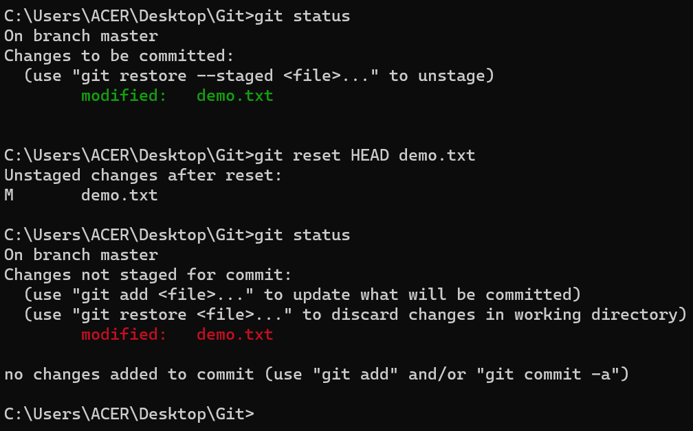
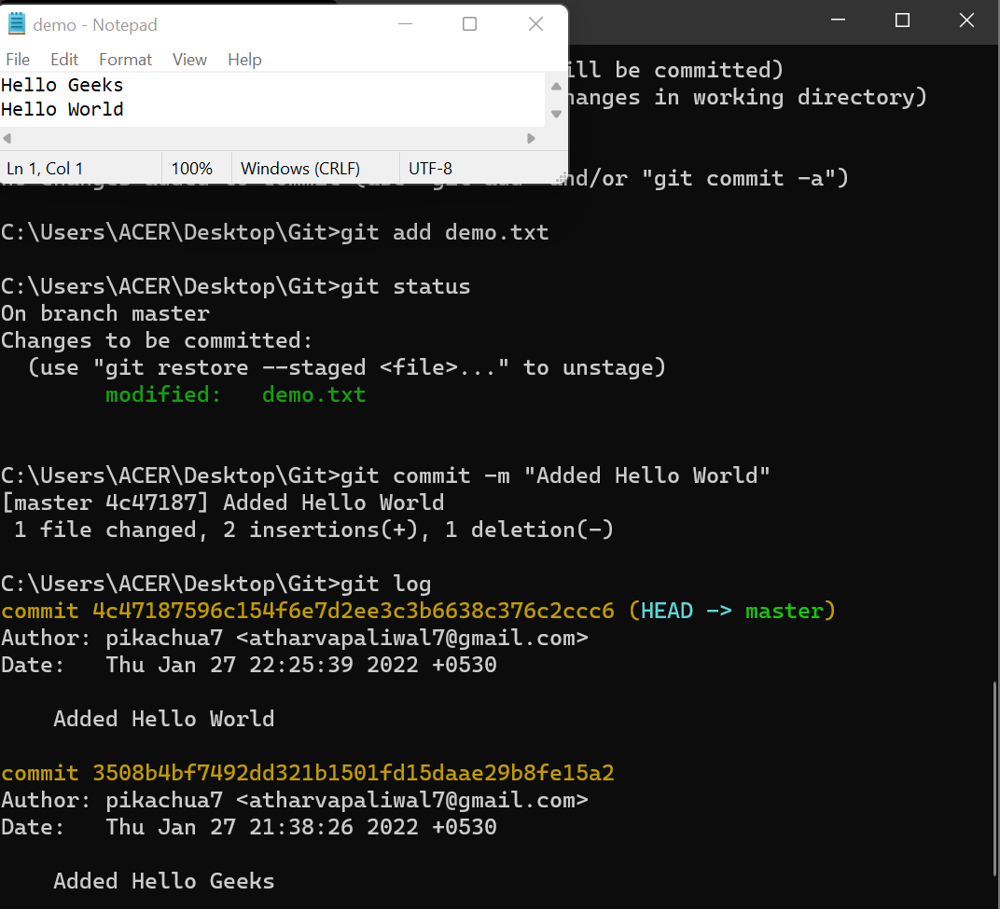
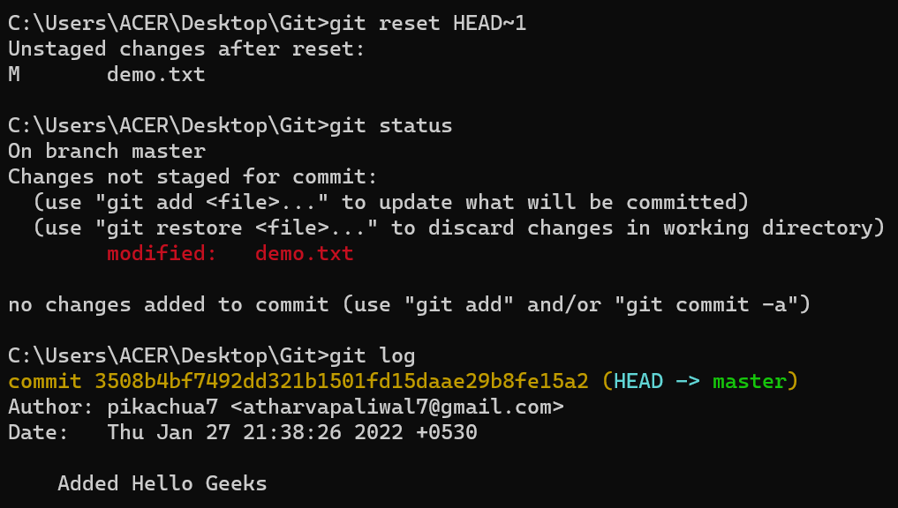
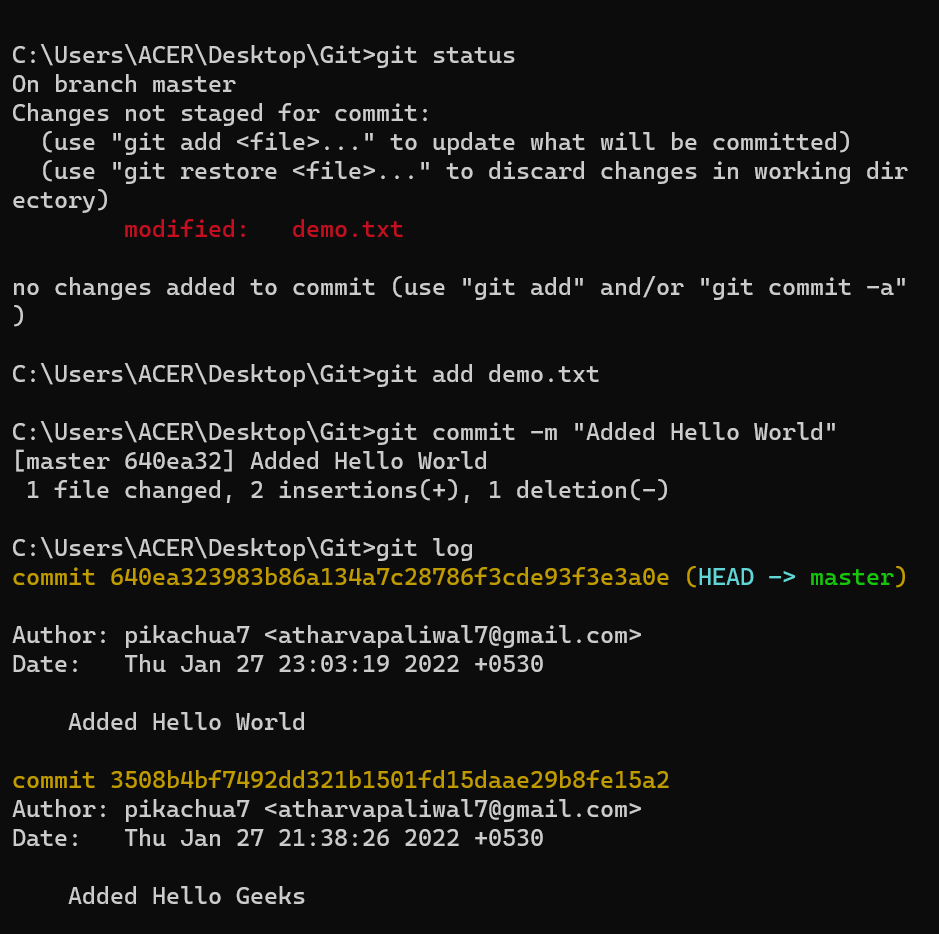
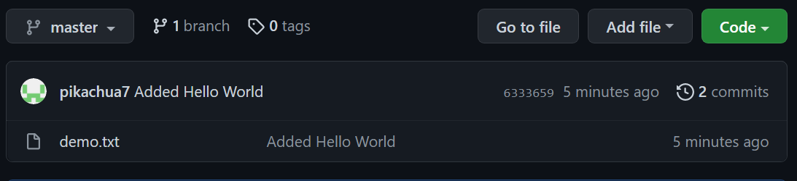
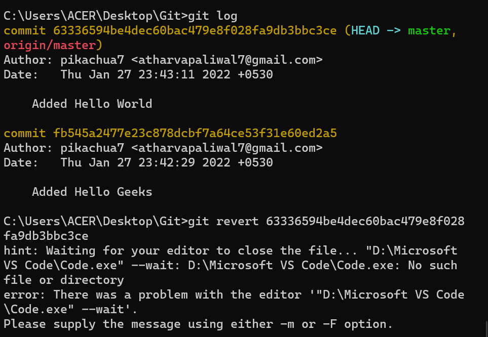
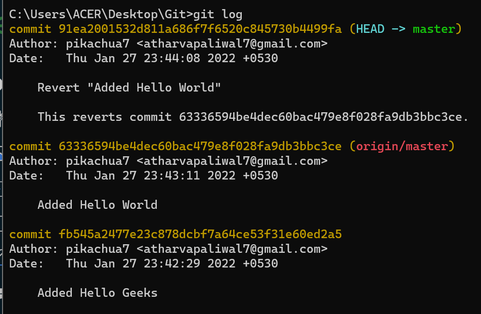
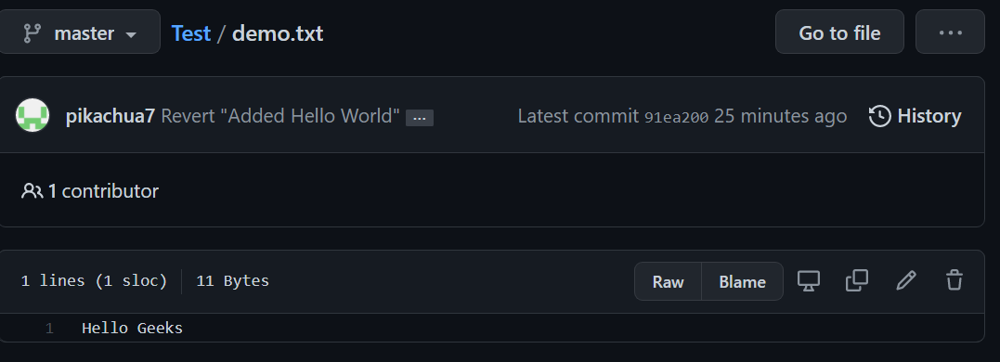

# git revert checkout and reset diff

Last Updated : 02 Jul, 2024

Git offers a range of commands to manage and manipulate your codebase. Among these commands, `git revert`, `git checkout`, and `git reset` are frequently used for different purposes. Understanding the differences between these commands is important for effective version control. In this article, we'll explore the functionalities and use cases of **`git revert`, `git checkout`, and `git reset`.**

Let's make a sample git repository with a file _**demo.txt**_ and "_**Hello Geeks**_" written inside it.

We can see that we have a single commit is done and the text document that has been committed with Hello Geeks in it. Now let's add some more text to our text document. Let's add another line _**Hello World.**_ Doing this change, our file now needs to be added to the staging area for getting the commit done. This updates are currently in the working area and to see them we will see those using _**git status**_.

Now we have a change _**Hello World**_ which is untracked in our working repository and we need to discard this change.



## git checkout

`git checkout` is used to discard the changes in the working repository.

> git checkout \<filename>

When we write git checkout command and see the status of our git repository and also the text document we can see that our changes are being discarded from the working directory and we are again back to the test document that we had before.

Now, what if we want to unstage a file? We stage our files before committing them and at a certain point, we might want to unstage a file. Let's add _**Hello World**_ again to our text document and stage them using the _**git add**_ command.



## git reset

`git reset` is used when we want to unstage a file and bring our changes back to the working directory. `git reset` can also be used to remove commits from the local repository.

> git reset HEAD \<filename>

Whenever we unstage a file, all the changes are kept in the working area.

We are back to the working directory, where our changes are present but the file is now unstaged. Now there are also some commits that we don't want to get committed and we want to remove them from our local repository. To see how to remove the commit from our local repository let's stage and commit the changes that we just did and then remove that commit.

We have 2 commits now, with the latest being the Added Hello World commit which we are going to remove.

> git reset HEAD\~1


**Points to be noted**

* `HEAD\~1` here means that we are going to remove the topmost commit or the latest commit that we have done.
* We cannot remove a specific commit with the help of git reset, for ex: we cannot say that we want to remove the second commit or the third commit, we can only remove latest commit or latest 2 commits ... latest N commits. (`HEAD\~n`) \[n here means n recent commits that needs to be deleted].


After using the above command we can see that our commit is being deleted and also our file is again unstaged and is back to the working directory. There are different ways in which git reset can actually keep your changes.

* _**git reset --soft HEAD\~1**_ - This command will remove the commit but would not unstage a file. Our changes still would be in the staging area.
* _**git reset --mixed HEAD\~1**_ or _**git reset HEAD\~1 -**_ This is the default command that we have used in the above example which removes the commit as well as unstages the file and our changes are stored in the working directory.
* _**git reset --hard HEAD\~1 -**_ This command removes the commit as well as the changes from your working directory. This command can also be called destructive command as we would not be able to get back the changes so be careful while using this command.

We just discussed above that the git reset command cannot be used to delete commits from the remote repository, then how do we remove the unwanted commits from the remote repository?



## git revert

`git revert` is used to remove the commits from the remote repository. Since now our changes are in the working directory, let's add those changes to the staging area and commit them.

Now let's push our changes to the remote repository. You can see [_**here**_](https://www.geeksforgeeks.org/git-lets-get-into-it/) how to push your changes from local repository to remote repository.

Now we want to delete the commit that we just added to the remote repository. We could have used the git reset command but that would have deleted the commit just from the local repository and not the remote repository. If we do this then we would get conflict that the remote commit is not present locally. So, we do not use git reset here. The best we can use here is git revert.

> git revert \<commit id of the commit that needs to be removed>


**Points to keep in mind**

* Using git revert we can undo any commit, not like git reset where we could just remove "n" recent commits.


Now let's first understand what git revert does, git revert removes the commit that we have done but adds one more commit which tells us that the revert has been done. Let's look at the example.


**Note**: If you see the lines as we got after the git revert command, just visit your default text editor for git and commit the message from there, or it could directly take to you your default editor. We want a message here because when using git revert, it does not delete the commit instead makes a new commit that contains the removed changes from the commit.


We can see that the new commit is being added. However since this commit is in local repository so we need to do _**git push**_ so that our remote repository also notices that the change has been done.

And as we can see we have a new commit in our remote repository and _**Hello World**_ which we added in our 2nd commit is being removed from the local as well as the remote repository.



## Difference Table

| git checkout                                     | git reset                                                            | git revert                                        |
| ------------------------------------------------ | -------------------------------------------------------------------- | ------------------------------------------------- |
| Discards the changes in the working repository.  | Unstages a file and bring our changes back to the working directory. | Removes the commits from the remote repository.   |
| Used in the local repository.                    | Used in local repository.                                            | Used in the remote repository.                    |
| Does not make any changes to the commit history. | Alters the existing commit history,                                  | Adds a new commit to the existing commit history. |
| Moves HEAD pointer to a specific commit.         | Discards the uncommitted changes.                                    | Rollbacks the changes which we have committed.    |
| Can be used to manipulate commits or files.      | Can be used to manipulate commits or files.                          | Does not manipulate your commits or files.        |
