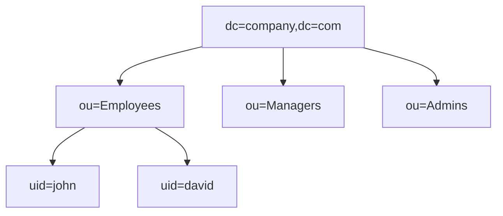

# ldap\_notes


**LDAP** is a protocol used to store, organize, and retrieve user and organizational information from a centralized directory service. Think of it as a central phonebook for an organization.


## Why Use LDAP?

Instead of creating separate user accounts across various tools (Jenkins, GitLab, SonarQube, VPN, Linux Servers), an organization uses LDAP as a single source of truth.

**Real-Time Example:**



## HR creates a user in LDAP

HR creates a user in LDAP when an employee joins.



## Employee accesses integrated tools

The employee can use **one username and password** to log into all integrated tools.



## Architecture & Directory Structure

LDAP uses a tree structure called the **DIT (Directory Information Tree)**.



### Common LDAP Terms

| Term    | Meaning                                                              |
| ------- | -------------------------------------------------------------------- |
| **DC**  | Domain Component                                                     |
| **OU**  | Organizational Unit                                                  |
| **CN**  | Common Name                                                          |
| **UID** | User ID                                                              |
| **DN**  | Distinguished Name (e.g., `uid=john,ou=Employees,dc=company,dc=com`) |

## Popular LDAP Servers

* OpenLDAP
* Microsoft Active Directory (AD) _(Note: AD uses LDAP as one of its protocols)_
* Red Hat Directory Server
* Apache Directory Server
* Oracle Internet Directory

## Ports

| Port    | Protocol                  |
| ------- | ------------------------- |
| **389** | LDAP                      |
| **636** | LDAPS (LDAP over SSL/TLS) |

## Common Comparisons

### LDAP vs Active Directory

* **LDAP** is a protocol (open standard).
* **Active Directory** is a Microsoft directory service product that _uses_ the LDAP protocol.

### LDAP vs Kerberos

* **LDAP** is a directory service protocol (stores user info, searches users).
* **Kerberos** is an authentication protocol (issues tickets, verifies identity).
* _They are often used together in enterprise environments._

### LDAP vs SAML vs OAuth

| Feature        | LDAP               | SAML                            | OAuth                     |
| -------------- | ------------------ | ------------------------------- | ------------------------- |
| **Use Case**   | Directory protocol | Single Sign-On (SSO)            | Authorization             |
| **Function**   | Stores users       | Authenticates users across apps | Grants application access |
| **Common For** | Internal networks  | Enterprise web apps             | APIs and mobile apps      |

## DevOps Use Cases

* **Jenkins:** Authenticates users through LDAP. Jenkins forwards credentials to LDAP; if valid, Jenkins grants access.
* **GitLab:** Uses LDAP for centralized login.
* **SonarQube:** Integrates with LDAP for authentication.
* **Nexus/Artifactory:** Manages access based on LDAP groups.
* **Kubernetes:** Dashboards can integrate with LDAP via identity providers.
* **VPN & Linux:** Authenticated against LDAP for centralized accounts.

## Useful Commands (Linux)

**Install LDAP client:**

```bash
sudo apt install libnss-ldap libpam-ldap ldap-utils
```

**Search all users:**

```bash
ldapsearch -x -b "dc=company,dc=com"
```

**Search by specific username:**

```bash
ldapsearch -x "(uid=john)"
```

**Search groups:**

```bash
ldapsearch -x "(objectClass=groupOfNames)"
```
